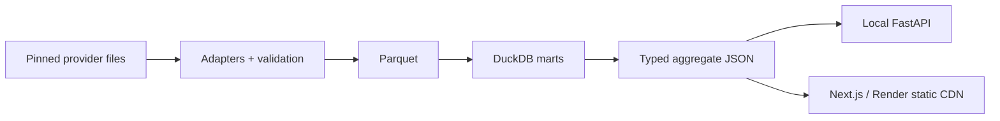

# Football Recruitment Intelligence

Open-data football research with explicit provenance, canonical event/tracking contracts and reproducible analytical tables.

[Live preview](https://football-recruitment-intelligence.onrender.com/) · [Phase 1 PR](https://github.com/frenk4business/football-recruitment-intelligence/pull/1) · [English](README.md) · [Nederlands](README.nl.md) · [Data audit](docs/data-sources.md) · [Architecture](docs/architecture.md)

**Phase 1: data foundation.** The bilingual explorer uses real ingested observations. Player similarity, league translation and recruitment recommendations are planned, not implemented. This is independent research and does not reproduce any organisation's proprietary methods.

Research question: **How can open football data support useful, explainable and uncertainty-aware recruitment decisions?** First establish whether the underlying evidence can be represented and inspected reliably.

## What is here

- StatsBomb event and SkillCorner tracking adapters with pinned inputs, checksum-verified caches and deterministic IDs.
- Typed canonical tables, coordinate transforms, explicit quality reports, Parquet storage and DuckDB player-match/player-season/team-season marts.
- FastAPI response contracts, generated TypeScript definitions and a Next.js English/Dutch product.
- Match exploration, player filtering, coarse event-location analysis, a tracking slider, data coverage and methodology.
- Offline fixture tests, GitHub Actions and a static Render deployment configuration. No hosted database or paid data/model API.

## Architecture



[Architecture and trade-offs](docs/architecture.md) · [Data model](docs/data-model.md) · [Decision records](docs/adr/001-duckdb-parquet.md)

## Data actually used

| Provider | Observation | Ingested records | Boundary |
|---|---|---|---|
| StatsBomb | Argentina–France, 18 Dec 2022, FIFA World Cup | 4,407 events; 50 roster players | Full match including extra time/shootout; public metrics exclude shootout |
| SkillCorner | Western United–Sydney FC, 27 Apr 2025, A-League 2024/25 | 60 frames; 1,380 objects; 36 roster players | First 60 seconds, 1 Hz; roster/minutes metadata refers to full match |

These are different matches and independent identities. Roster players include unused substitutes. Six inconsistent StatsBomb minute intervals and five absent SkillCorner playing-time entries remain null. Two event-order timestamp anomalies and 29 actorless events are reported. [Methods and limitations](docs/methodology.md).

**Data rights differ from code rights.** StatsBomb's agreement restricts raw redistribution and commercial exploitation. Only derived research aggregates/bins are public. SkillCorner's MIT notice is retained. Source names, licence links and the StatsBomb logo appear in the UI. Raw downloads and Parquet are ignored by Git. See [ATTRIBUTION](ATTRIBUTION.md) before reuse.

## Run locally

Requirements: Python 3.12+, [uv](https://docs.astral.sh/uv/), Node **24.19.0**, npm and Make. Use the pinned versions/lockfiles; no account or secret is needed for local functionality. Source use remains subject to provider terms.

```sh
git clone --branch phase/01-data-foundation https://github.com/frenk4business/football-recruitment-intelligence.git
cd football-recruitment-intelligence
make setup
make test
make data-bootstrap
make dev
```

The web app is at `http://localhost:3000`, Dutch at `/nl/`. Committed public artifacts also let the web build and tests work before downloading raw data. `make dev` runs the web process; `make api` optionally starts the local API separately.

## Data commands

```sh
make data-bootstrap    # pinned small downloads, validation, Parquet, marts and public artifacts
make data-statsbomb    # retrieve/cache only StatsBomb sample inputs
make data-tracking     # retrieve/cache only the bounded tracking slice
make data-build        # rebuild offline from checked caches
make data-validate     # validate current canonical Parquet
make data-coverage     # show actual coverage JSON
uv run fri data discover statsbomb
```

Canonical and mart tables are in `data/processed/`. Queries use `football_intelligence.data.marts.connect(Path('data/processed'))`; it creates DuckDB views over Parquet. Source-specific IDs, original payloads, dates and quality flags remain available locally. [Provenance](docs/data-provenance.md) explains reproducibility and deliberate publication limits.

## Tests, web and API

```sh
make test             # Python/frontend lint, typechecks, tests and generated-contract check
make build            # static Next.js export
cd apps/web && npx playwright install chromium && cd ../..
make smoke            # both languages, interactions, mobile, accessibility, error state
make api              # localhost:8000; /health, /docs, /api/v1/coverage and more
make contracts        # regenerate public TypeScript/JSON/OpenAPI contracts
```

Tests use tiny clearly labelled synthetic fixtures; production artifacts use real data. They check adapter errors, coordinates, identity stability, references, quality anomalies, null semantics, SQL totals, deterministic Parquet, API validation and the no-raw-event export boundary. CI downloads no football dataset. [API contract](docs/api.md).

## Deployment and cost

Render builds the static site from committed aggregates; the API remains local to avoid cold starts and unnecessary services. `render.yaml` documents build/publish settings. Fixed recurring project infrastructure cost: **€0/month**, subject to workspace-level bandwidth/build allowances; excess usage can be billable under the existing account settings. No paid resources or trial database are required. [Deployment details](docs/deployment.md).

## Roadmap and learning

1. Data foundation — current
2. Player DNA & similarity — planned
3. League translation & performance transfer — planned
4. Recruitment intelligence — planned
5. Product hardening & portfolio integration — planned

The additional portfolio evidence is heterogeneous data engineering, canonical identities, provenance, data contracts, analytical SQL, source-aware product design and reproducible testing. [Portfolio context](docs/portfolio-context.md) · [Roadmap](docs/roadmap.md) · [Phase 2 hand-off](docs/phase-2-handoff.md).

The current sample cannot establish player quality, competition strength or transfer success. No physical performance estimate is derived from 1 Hz tracking. Expanding the pinned cohort, resolving minutes conservatively and validating temporal coverage must precede any similarity model. Build snapshots assume one local writer. See source and architecture documents for the remaining practical limits.

Code © 2026 Frenk Kester, MIT. Data and logos retain their own rights. Credit StatsBomb, SkillCorner and PySport as described in [ATTRIBUTION.md](ATTRIBUTION.md).
