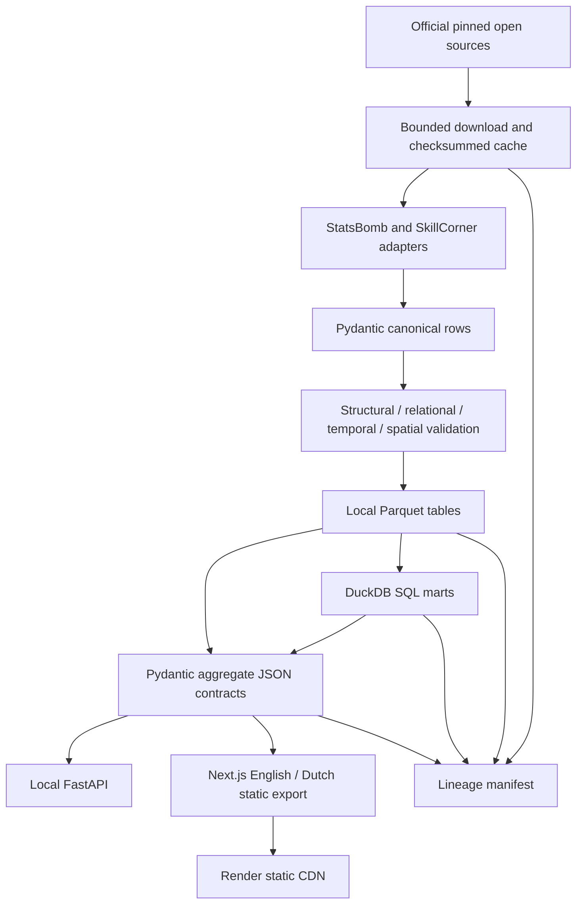

# Architecture

Phase 1 is local-first: one Python package owns retrieval, contracts, transformations and analytics. A Next.js static export is the public product. The FastAPI service remains local because the same small validated JSON contracts can serve the preview without a sleeping backend or hosted database.

`config/sample.json` pins revisions, selected IDs, frame window and SHA-256 values. The downloader caches source bytes; repeat fetches validate the cache. Provider adapters only normalize supplied input, making tests fully offline. IDs are UUID5 over provider/entity/provider-ID, with match-scoped keys for lineup/frame/object records. No fuzzy identities are merged.

Parquet has explicit schemas, Zstandard compression and statistics. At this size, one file per table is simpler than partitioning hundreds of tiny files. Each build validates first and stages Parquet before copying it to the processed directory. There is no distributed transaction or concurrent-writer support; run one build at a time. DuckDB runs in memory and queries those local files directly. Expansion should introduce provider/competition/season partitions and lazy scans when measurements justify them.

The public export is a deliberate publication boundary: it omits raw StatsBomb events and private caches. Individual explorer artifacts load only after match selection; the browser never receives a full tracking match. TypeScript definitions are generated from Pydantic, while OpenAPI documents the API. Both paths use identical payloads. API queries are predefined; all identifiers and pagination bounds are validated.

The one optional extension is the **lineage manifest**: revisions/checksums → canonical row counts/Parquet checksums → SQL marts → public artifacts. It makes reproducibility inspectable without introducing a scheduler or warehouse.

The static site consumes committed research summaries, so deployment requires Node only and no external football-source access. Updating data is explicit (`make data-bootstrap`), followed by reviewing and committing aggregate artifacts. Later phases may add a feature layer, similarity service and model registry; none exist yet.
