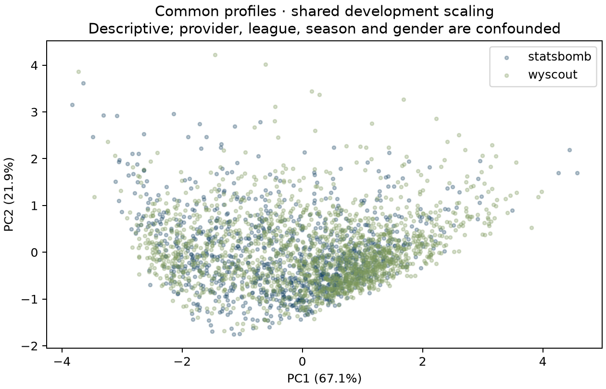

# Common profile evaluation — v1.1

Reproduce with `make v11-data-build`. The source/semantic audit preceded expanded event ingestion. The [experiment plan](v1.1-experiment-plan.md) records both pre-evaluation amendments; the machine-readable results are in [`evaluation.json`](../artifacts/v11/evaluation.json). Frozen Phase 1–4 research is separate.

## Feature decisions and missingness

`common-profile-v1` contains exactly **non-penalty shots per90, all pass attempts per90 including restarts, and long pass attempts ≥30 m per90**. A nominal 90-minute denominator and a shared 105×68 m geometry are explicit. Common comparisons display unscaled rates; similarity uses shared development z-scaling. Goalkeepers are excluded from the common representation.

Seven candidates passed the initial conceptual mapping, but four completion-dependent candidates failed the full-season availability screen: legitimate StatsBomb Unknown outcomes leave only 30 EPL development profiles at 450 minutes. No successful threshold/classifier result preceded their removal. Completion, progressive passes, final-third entries and box entries remain tested candidate formulas, not deployed common dimensions. Neither unknown outcomes nor missing geometry are imputed. See the [semantic matrix](provider-feature-semantics.md) and [`candidate-availability.json`](../artifacts/v11/candidate-availability.json). Three dimensions offer much less style detail than validated WSL Player DNA.

## Threshold selection and temporal retrieval

Within each provider/competition-season, split matches chronologically at the median match. Full profiles must be reliable, and each half needs at least half the total-minute threshold. Only same-identity pairs with the same broad role enter each retrieval cohort (minimum 20). This is a survivor/stable-role sample, not all searchable players. First-half development profiles from StatsBomb EPL 2015/16 and Wyscout EPL 2017/18 alone fit all scalers. Other leagues are method-transfer checks, not prospective external validation.

| Minutes | Development macro-provider MRR | Common profiles |
| ---: | ---: | ---: |
| 450 | 0.298713 | 2840 |
| 600 | 0.313821 | 2621 |
| 900 | 0.331736 | 2225 |

The registered smallest-threshold-at-90%-of-best rule selects **450 minutes**. This decision is close to its boundary: 450-minute development MRR is 0.298713 versus a 90%-of-best cutoff of 0.298563. The higher-threshold sensitivity is retained; 450 is an evidence/coverage trade-off, not proof that 450-minute profiles are as stable as 900-minute profiles.

| Scaling | Minutes | Provider | Queries | MRR | 95% query-bootstrap interval |
| --- | ---: | --- | ---: | ---: | --- |
| raw | 450 | statsbomb | 684 | 0.2765 | 0.2532–0.2998 |
| raw | 450 | wyscout | 1385 | 0.1982 | 0.1832–0.2135 |
| raw | 600 | statsbomb | 618 | 0.2976 | 0.2736–0.3242 |
| raw | 600 | wyscout | 1300 | 0.2071 | 0.1916–0.2226 |
| raw | 900 | statsbomb | 482 | 0.3298 | 0.3000–0.3591 |
| raw | 900 | wyscout | 1120 | 0.2336 | 0.2160–0.2508 |
| shared | 450 | statsbomb | 684 | 0.3484 | 0.3235–0.3732 |
| shared | 450 | wyscout | 1385 | 0.2601 | 0.2436–0.2768 |
| shared | 600 | statsbomb | 618 | 0.3718 | 0.3444–0.3989 |
| shared | 600 | wyscout | 1300 | 0.2715 | 0.2532–0.2887 |
| shared | 900 | statsbomb | 482 | 0.4084 | 0.3778–0.4412 |
| shared | 900 | wyscout | 1120 | 0.3041 | 0.2837–0.3243 |
| provider_global | 450 | statsbomb | 684 | 0.3530 | 0.3275–0.3798 |
| provider_global | 450 | wyscout | 1385 | 0.2626 | 0.2452–0.2794 |
| provider_global | 600 | statsbomb | 618 | 0.3781 | 0.3509–0.4061 |
| provider_global | 600 | wyscout | 1300 | 0.2746 | 0.2570–0.2925 |
| provider_global | 900 | statsbomb | 482 | 0.4146 | 0.3819–0.4474 |
| provider_global | 900 | wyscout | 1120 | 0.3047 | 0.2856–0.3246 |
| provider_role | 450 | statsbomb | 684 | 0.3528 | 0.3267–0.3797 |
| provider_role | 450 | wyscout | 1385 | 0.2612 | 0.2440–0.2778 |
| provider_role | 600 | statsbomb | 618 | 0.3764 | 0.3494–0.4037 |
| provider_role | 600 | wyscout | 1300 | 0.2722 | 0.2547–0.2906 |
| provider_role | 900 | statsbomb | 482 | 0.4127 | 0.3820–0.4440 |
| provider_role | 900 | wyscout | 1120 | 0.3007 | 0.2819–0.3204 |

### Selected common-similarity-v1, per cohort

| Cohort / role | n | Recall@1 | Recall@5 | Recall@10 | MRR | Random expected MRR |
| --- | ---: | ---: | ---: | ---: | ---: | ---: |
| statsbomb-11-27 / DEF | 57 | 0.105 | 0.404 | 0.649 | 0.269 | 0.081 |
| statsbomb-11-27 / FWD | 48 | 0.250 | 0.542 | 0.750 | 0.413 | 0.093 |
| statsbomb-11-27 / MID | 31 | 0.355 | 0.774 | 0.935 | 0.540 | 0.130 |
| statsbomb-12-27 / DEF | 19 | — | — | — | — | — |
| statsbomb-12-27 / FWD | 15 | — | — | — | — | — |
| statsbomb-12-27 / MID | 13 | — | — | — | — | — |
| statsbomb-135-281 / DEF | 42 | 0.143 | 0.619 | 0.738 | 0.336 | 0.103 |
| statsbomb-135-281 / FWD | 33 | 0.212 | 0.485 | 0.667 | 0.352 | 0.124 |
| statsbomb-135-281 / MID | 29 | 0.276 | 0.655 | 0.828 | 0.454 | 0.137 |
| statsbomb-2-27 / DEF | 80 | 0.150 | 0.450 | 0.613 | 0.298 | 0.062 |
| statsbomb-2-27 / FWD | 80 | 0.150 | 0.450 | 0.588 | 0.290 | 0.062 |
| statsbomb-2-27 / MID | 56 | 0.250 | 0.625 | 0.732 | 0.408 | 0.082 |
| statsbomb-37-281 / DEF | 48 | 0.188 | 0.521 | 0.750 | 0.345 | 0.093 |
| statsbomb-37-281 / FWD | 41 | 0.098 | 0.439 | 0.634 | 0.259 | 0.105 |
| statsbomb-37-281 / MID | 34 | 0.265 | 0.676 | 0.853 | 0.435 | 0.121 |
| statsbomb-37-90 / DEF | 36 | 0.139 | 0.583 | 0.722 | 0.322 | 0.116 |
| statsbomb-37-90 / FWD | 36 | 0.194 | 0.639 | 0.694 | 0.372 | 0.116 |
| statsbomb-37-90 / MID | 33 | 0.121 | 0.606 | 0.667 | 0.324 | 0.124 |
| wyscout-364-181150 / DEF | 118 | 0.085 | 0.314 | 0.534 | 0.208 | 0.045 |
| wyscout-364-181150 / FWD | 56 | 0.179 | 0.518 | 0.732 | 0.339 | 0.082 |
| wyscout-364-181150 / MID | 118 | 0.169 | 0.458 | 0.576 | 0.309 | 0.045 |
| wyscout-412-181189 / DEF | 105 | 0.095 | 0.305 | 0.448 | 0.214 | 0.050 |
| wyscout-412-181189 / FWD | 65 | 0.123 | 0.431 | 0.585 | 0.262 | 0.073 |
| wyscout-412-181189 / MID | 109 | 0.193 | 0.505 | 0.642 | 0.337 | 0.048 |
| wyscout-426-181137 / DEF | 95 | 0.137 | 0.305 | 0.368 | 0.225 | 0.054 |
| wyscout-426-181137 / FWD | 51 | 0.059 | 0.392 | 0.529 | 0.221 | 0.089 |
| wyscout-426-181137 / MID | 103 | 0.097 | 0.320 | 0.466 | 0.218 | 0.051 |
| wyscout-524-181248 / DEF | 109 | 0.110 | 0.321 | 0.450 | 0.218 | 0.048 |
| wyscout-524-181248 / FWD | 68 | 0.206 | 0.485 | 0.574 | 0.336 | 0.071 |
| wyscout-524-181248 / MID | 100 | 0.160 | 0.420 | 0.590 | 0.284 | 0.052 |
| wyscout-795-181144 / DEF | 116 | 0.069 | 0.336 | 0.517 | 0.210 | 0.046 |
| wyscout-795-181144 / FWD | 57 | 0.211 | 0.491 | 0.632 | 0.360 | 0.081 |
| wyscout-795-181144 / MID | 115 | 0.113 | 0.400 | 0.574 | 0.253 | 0.046 |

Match bootstrap resamples observed appearances independently for **both query and candidate profiles**, with a fixed development scaler, 40 replicates and up to 12 queries per cohort. Mean top-ten Jaccard ranges from **0.293 to 0.603**. It conditions on the observed schedule and reliable included profiles; it does not model opponent dependence, future availability or source annotation uncertainty. Full cohort intervals and candidate/query counts are in the JSON report. Each Jaccard interval is the empirical replicate/query spread, not a confidence interval for the mean.

## Held-out provider classification

A fixed balanced logistic regression (C=1), with a training-only standard scaler, predicts provider from the common vector. A 30% held-out split groups provider player IDs, preventing the same identity in multiple seasons from crossing train/test. Primary analysis matches provider counts within broad role and the three shared league names; seasons remain different. No hyperparameter optimisation.

| Analysis | Train / held-out profiles | AUC (95% identity-bootstrap CI) | Balanced accuracy (95% CI) |
| --- | ---: | --- | --- |
| primary: men_shared_leagues_role_matched | 769 / 331 | 0.702 (0.649–0.759) | 0.653 (0.603–0.709) |
| secondary: all_eligible_including_gender_coverage_confound | 1986 / 854 | 0.729 (0.691–0.768) | 0.656 (0.624–0.690) |

**Provider measurement remains detectable despite semantic harmonisation.** The point estimates do not trigger the predeclared >0.75 veto, but the AUC intervals overlap 0.75. Passing a veto is not positive validation. Public cross-provider nearest-neighbour ranking is therefore **withheld**: three dimensions, no cross-provider identity ground truth and confounded league/time/gender cannot establish player-style equivalence. Manual descriptive comparison remains available using only common v1; within-provider rankings enforce competition-season and broad role. No domain adaptation is deployed.

## Provider distributions and neighbourhood composition

Every accepted feature is audited by broad role, both across all included data and within the three shared league names. The full report contains n, mean, median, population SD, 5/25/75/95% quantiles, KS statistic and raw-unit Wasserstein distance. League/year differences are confounded with provider; these are not paired annotation error estimates.

| League | Role | Feature | SB mean / median / SD | Wyscout mean / median / SD | KS | Wasserstein |
| --- | --- | --- | --- | --- | ---: | ---: |
| all | DEF | non_penalty_shots_per90 | 0.511 / 0.455 / 0.351 | 0.450 / 0.390 / 0.302 | 0.116 | 0.064 |
| all | DEF | passes_all_per90 | 49.865 / 48.624 / 13.935 | 50.084 / 48.253 / 12.007 | 0.084 | 1.577 |
| all | DEF | long_passes_all_per90 | 6.467 / 6.068 / 2.547 | 9.393 / 9.036 / 2.657 | 0.474 | 2.932 |
| all | FWD | non_penalty_shots_per90 | 2.175 / 2.034 / 0.965 | 2.295 / 2.224 / 0.807 | 0.153 | 0.199 |
| all | FWD | passes_all_per90 | 32.084 / 30.267 / 10.677 | 26.472 / 24.009 / 10.487 | 0.273 | 5.624 |
| all | FWD | long_passes_all_per90 | 2.710 / 2.080 / 1.988 | 2.991 / 2.378 / 2.111 | 0.111 | 0.283 |
| all | MID | non_penalty_shots_per90 | 1.205 / 1.061 / 0.726 | 1.246 / 1.115 / 0.693 | 0.060 | 0.059 |
| all | MID | passes_all_per90 | 47.640 / 46.874 / 14.288 | 47.128 / 45.051 / 14.968 | 0.066 | 1.422 |
| all | MID | long_passes_all_per90 | 5.337 / 4.790 / 2.742 | 6.992 / 6.608 / 2.886 | 0.275 | 1.655 |
| england | DEF | non_penalty_shots_per90 | 0.524 / 0.455 / 0.348 | 0.465 / 0.415 / 0.336 | 0.117 | 0.067 |
| england | DEF | passes_all_per90 | 47.096 / 48.162 / 12.377 | 49.332 / 45.506 / 14.451 | 0.109 | 3.222 |
| england | DEF | long_passes_all_per90 | 6.645 / 6.418 / 2.146 | 9.351 / 9.267 / 2.438 | 0.511 | 2.706 |
| england | FWD | non_penalty_shots_per90 | 2.336 / 2.242 / 0.804 | 2.358 / 2.301 / 0.866 | 0.090 | 0.085 |
| england | FWD | passes_all_per90 | 34.974 / 32.954 / 11.018 | 25.058 / 22.870 / 9.819 | 0.510 | 9.916 |
| england | FWD | long_passes_all_per90 | 3.023 / 2.385 / 2.369 | 2.445 / 1.856 / 2.128 | 0.230 | 0.737 |
| england | MID | non_penalty_shots_per90 | 1.179 / 1.077 / 0.635 | 1.271 / 1.165 / 0.640 | 0.101 | 0.100 |
| england | MID | passes_all_per90 | 54.471 / 52.069 / 13.141 | 48.184 / 45.925 / 17.006 | 0.287 | 7.459 |
| england | MID | long_passes_all_per90 | 6.187 / 6.155 / 2.473 | 7.050 / 6.681 / 3.093 | 0.149 | 0.864 |
| italy | DEF | non_penalty_shots_per90 | 0.520 / 0.375 / 0.431 | 0.421 / 0.362 / 0.280 | 0.203 | 0.116 |
| italy | DEF | passes_all_per90 | 47.047 / 46.414 / 11.040 | 51.772 / 49.867 / 12.526 | 0.160 | 4.725 |
| italy | DEF | long_passes_all_per90 | 5.808 / 5.794 / 1.726 | 9.241 / 8.971 / 2.428 | 0.618 | 3.433 |
| italy | FWD | non_penalty_shots_per90 | 2.235 / 2.080 / 0.815 | 2.362 / 2.314 / 0.823 | 0.225 | 0.235 |
| italy | FWD | passes_all_per90 | 34.380 / 34.556 / 11.911 | 27.403 / 24.950 / 11.499 | 0.317 | 7.362 |
| italy | FWD | long_passes_all_per90 | 2.929 / 2.595 / 1.887 | 3.373 / 2.562 / 2.355 | 0.141 | 0.458 |
| italy | MID | non_penalty_shots_per90 | 1.205 / 1.004 / 0.675 | 1.216 / 1.069 / 0.694 | 0.065 | 0.083 |
| italy | MID | passes_all_per90 | 53.660 / 53.796 / 16.294 | 49.223 / 46.546 / 14.987 | 0.212 | 4.946 |
| italy | MID | long_passes_all_per90 | 6.260 / 5.715 / 3.223 | 7.130 / 6.683 / 2.896 | 0.222 | 0.984 |
| spain | DEF | non_penalty_shots_per90 | 0.454 / 0.419 / 0.275 | 0.433 / 0.358 / 0.299 | 0.113 | 0.039 |
| spain | DEF | passes_all_per90 | 46.634 / 46.731 / 10.384 | 48.608 / 47.598 / 11.437 | 0.144 | 2.211 |
| spain | DEF | long_passes_all_per90 | 6.822 / 6.661 / 1.992 | 9.521 / 8.856 / 2.998 | 0.383 | 2.699 |
| spain | FWD | non_penalty_shots_per90 | 2.091 / 1.965 / 0.929 | 2.159 / 2.122 / 0.858 | 0.168 | 0.230 |
| spain | FWD | passes_all_per90 | 36.167 / 34.527 / 10.533 | 27.244 / 24.311 / 10.835 | 0.401 | 8.948 |
| spain | FWD | long_passes_all_per90 | 3.259 / 2.771 / 2.225 | 3.013 / 2.459 / 1.882 | 0.108 | 0.374 |
| spain | MID | non_penalty_shots_per90 | 1.095 / 0.887 / 0.628 | 1.183 / 1.062 / 0.637 | 0.167 | 0.103 |
| spain | MID | passes_all_per90 | 52.537 / 50.857 / 11.898 | 46.009 / 43.338 / 14.363 | 0.317 | 6.623 |
| spain | MID | long_passes_all_per90 | 6.595 / 6.304 / 3.090 | 7.023 / 6.421 / 3.039 | 0.114 | 0.470 |

| Scaling | Role | Provider | Same-provider top-ten share | Same-provider candidate share |
| --- | --- | --- | ---: | ---: |
| raw | DEF | statsbomb | 0.543 | 0.381 |
| raw | DEF | wyscout | 0.737 | 0.618 |
| raw | MID | statsbomb | 0.395 | 0.299 |
| raw | MID | wyscout | 0.752 | 0.700 |
| raw | FWD | statsbomb | 0.591 | 0.482 |
| raw | FWD | wyscout | 0.647 | 0.517 |
| shared | DEF | statsbomb | 0.550 | 0.381 |
| shared | DEF | wyscout | 0.743 | 0.618 |
| shared | MID | statsbomb | 0.385 | 0.299 |
| shared | MID | wyscout | 0.745 | 0.700 |
| shared | FWD | statsbomb | 0.602 | 0.482 |
| shared | FWD | wyscout | 0.639 | 0.517 |
| provider_global | DEF | statsbomb | 0.413 | 0.381 |
| provider_global | DEF | wyscout | 0.673 | 0.618 |
| provider_global | MID | statsbomb | 0.314 | 0.299 |
| provider_global | MID | wyscout | 0.734 | 0.700 |
| provider_global | FWD | statsbomb | 0.520 | 0.482 |
| provider_global | FWD | wyscout | 0.594 | 0.517 |
| provider_role | DEF | statsbomb | 0.389 | 0.381 |
| provider_role | DEF | wyscout | 0.659 | 0.618 |
| provider_role | MID | statsbomb | 0.377 | 0.299 |
| provider_role | MID | wyscout | 0.764 | 0.700 |
| provider_role | FWD | statsbomb | 0.526 | 0.482 |
| provider_role | FWD | wyscout | 0.602 | 0.517 |

Raw, shared, provider-global and provider/role scaling are all reported. Provider-specific scalers change neighbour composition and may conceal real measurement differences; they are sensitivity experiments, never evidence that the providers became equivalent. Shared scaling is the explicitly versioned published within-cohort method. Neighbour ties resolve by profile ID.

PCA is descriptive on all eligible profiles after development-fitted shared scaling. Its axes are not used for similarity or tuned for separation; loadings and explained variance are in `artifacts/v11/pca.json`.

## Unchanged research and limits

Searchable, common-comparable, similarity-capable and historical-translation eligibility are different flags. Expanded StatsBomb raw profiles are `statsbomb-profile-v2`, not a revalidation of WSL `player-dna-v1`. Wyscout `wyscout-profile-v1` has broad metadata roles; no CB/DM positions are invented. Exact StatsBomb IDs link only the original WSL 2023/24 DNA capability. No selected scope is the original Phase-3 2019/20 source cohort, so expanded translation flags are false. No expanded profile enters Phase-4 recruitment.

Source event coverage can be incomplete despite a complete schedule; 809 player-seasons have unresolved participation conflicts and are excluded as a whole. Keeper and geometric-availability exclusions further narrow common coverage. No cross-provider identity resolution, causal provider-effect estimate, commercial-feed coverage, longitudinal transfer utility, live data refresh or expanded recruitment validation is claimed.
