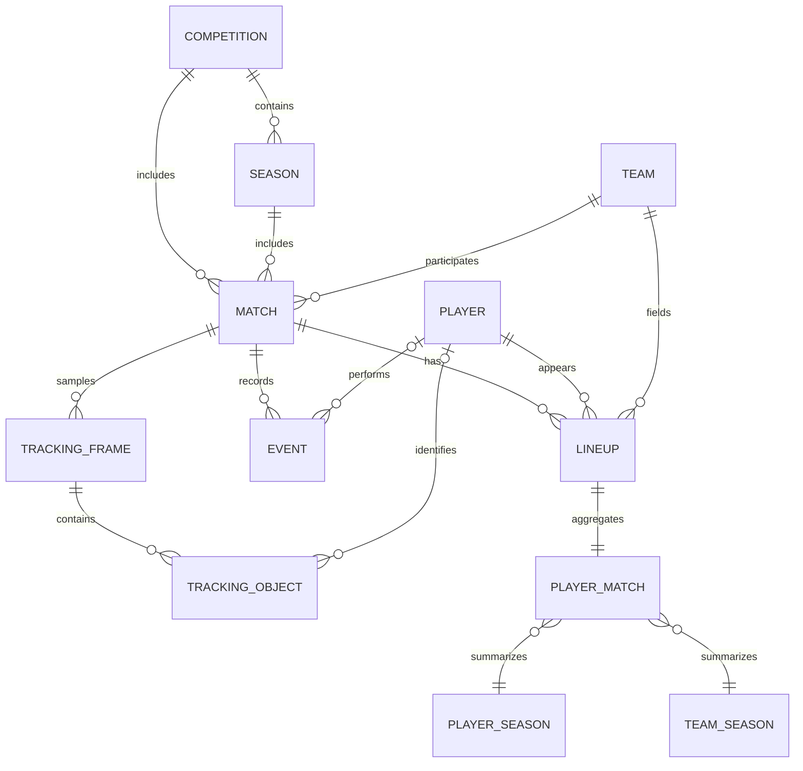

# Canonical model v1.0.0

Executable contracts: `src/football_intelligence/data/schema.py`. Every canonical record has `id`, `provider`, `provider_id`, `provenance_id` and `observed_on`. Date means the match observation date; source retrieval timestamps belong to the manifest. `provider_entity_map` provides exact-provider identity mappings, not proof that two providers refer to the same person.

| Table | Key and content |
|---|---|
| competitions | Source competition ID, name, country, gender; tier nullable |
| seasons | Provider competition + season key, label and years |
| teams | Source team ID and name; country nullable |
| players | Source player ID, full source name, optional birth date/nationality |
| matches | Source match ID, competition/season, date, two teams, score, optional actual pitch size and explicit coverage description |
| lineups | Match + player; team, starter, canonical position, all original position intervals as JSON, minutes/method and substitution labels |
| events | Original event ID; index, period, time, team/player, type/subtype/outcome, coordinates, possession, body part, supplied xG and entire original payload JSON |
| tracking_frames | Match + source frame; period, elapsed time, original provider timestamp, possession team and home attack direction |
| tracking_objects | Match + frame + object kind + player; x/y/z, raw x/y, detection flag, nullable uncertainty, in-pitch flag |
| provider_entity_map | Canonical ID, provider/type/ID/name, confidence, method, verified |
| player_match | Match/roster member; descriptive counts, source-dependent nulls, minutes and guarded per-90 |
| player_season | Observed sample aggregation, appearances and starts, never a claim of full-season coverage |
| team_season | Sample match count and event totals; player goals explicitly exclude own-goal events |

`Source` is the public provider contract in `contracts.py`; retrieval records and their stable provenance IDs live in `artifacts/manifest.json`. Every table row can be traced to those records. Dates use Parquet date types. Numeric coordinates/time use doubles, indexes use 64-bit integers, and unavailable values are null with stable column types even in empty tables.

Position taxonomy: GK, CB, FB/WB, DM, CM, AM, W, ST. Ambiguous labels stay null. All original positions remain available; the first listed role is a convenience label, not a fixed tactical identity. Goalkeepers remain in tables but should form their own cohort in Phase 2.

Canonical IDs are deterministic UUID5 (`fri:{provider}:{table}:{provider_id}`). Season IDs include competition ID. Match context is part of lineup/frame/object keys. Exact source IDs receive confidence 1 and verified=true only within that source namespace. Cross-provider resolution has not been performed.
