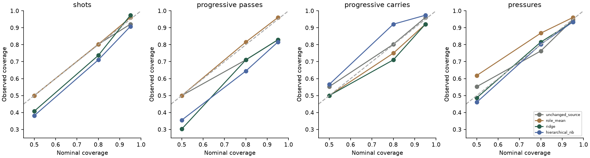
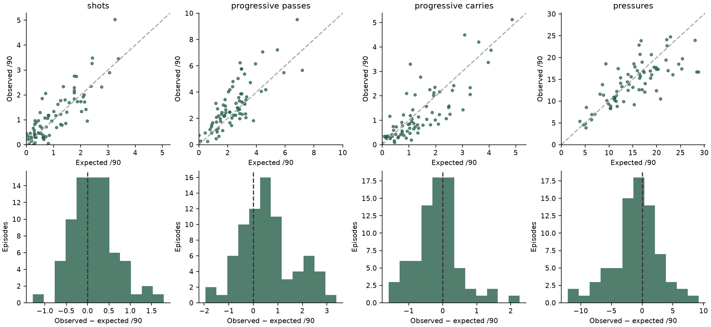
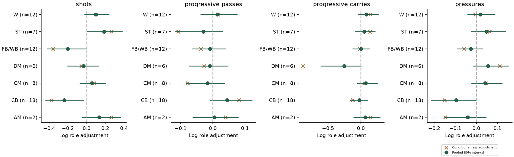
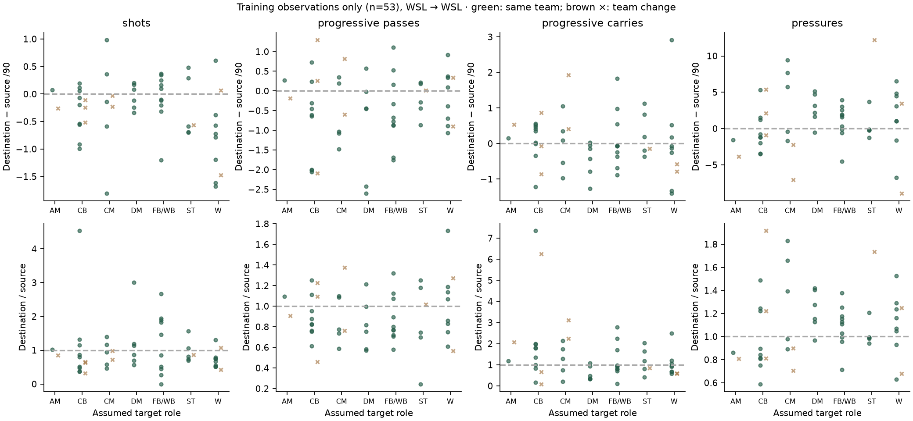

# Held-out WSL context translation evaluation

The later-season test was opened only after method selection was committed at `a330893`. The experiment was frozen at `bbed4d2`, after the separate evidence audit. All methods and sensitivity results are reported; the test did not change public method selection.

## Data and interpretation

53 train / 12 player-disjoint validation / 76 later-season test episodes. Refit development N=65. 41 test players have earlier development history; no player intercept is fitted. Four test episodes change recorded club, so this is principally next-season context prediction rather than a transfer-effect test. Target roles are supplied scenario assumptions, and target minutes condition the evaluation rather than being predicted.

600 reliable minutes required on both sides; seven outfield role groups in research. Train roles: `{'FB/WB': 10, 'CM': 7, 'CB': 12, 'ST': 6, 'W': 10, 'DM': 6, 'AM': 2}`; validation: `{'ST': 1, 'CM': 1, 'W': 2, 'CB': 6, 'FB/WB': 2}`; test: `{'AM': 2, 'FB/WB': 18, 'CB': 14, 'W': 18, 'ST': 8, 'CM': 7, 'DM': 9}`. Test destination dates: 2020-09-05–2021-05-09; all fitted outcomes end by 2020-02-23.

## Every method on the untouched season

Errors and widths are actions per 90. Intervals are future-observation intervals. Empirical baseline ranges use centred five-fold player-separated residuals, clipped at zero; Bayesian intervals simulate counts at each actual held-out exposure. LP density is the Bayesian mean log probability of the observed count; it is not comparable to a rate-density score or available for the empirical baselines.

| Target | Method | MAE | RMSE | 50% cover | 80% cover | 95% cover | 80% width | 80% interval score | Default |
|---|---|---:|---:|---:|---:|---:|---:|---:|---|
| shots | unchanged_source | 0.457 | 0.587 | 50.0% | 80.3% | 92.1% | 1.262 | 1.942 |  |
| shots | role_mean | 0.473 | 0.664 | 50.0% | 80.3% | 96.1% | 1.448 | 2.386 |  |
| shots | ridge | 0.397 | 0.533 | 40.8% | 73.7% | 97.4% | 0.969 | 1.895 | yes |
| shots | hierarchical_nb | 0.404 | 0.528 | 38.2% | 71.1% | 90.8% | 1.131 | 1.702 |  |
| progressive_passes | unchanged_source | 0.911 | 1.270 | 50.0% | 71.1% | 82.9% | 2.393 | 5.062 |  |
| progressive_passes | role_mean | 1.149 | 1.486 | 50.0% | 81.6% | 96.1% | 3.810 | 5.311 |  |
| progressive_passes | ridge | 0.920 | 1.230 | 30.3% | 71.1% | 82.9% | 1.889 | 4.894 | yes |
| progressive_passes | hierarchical_nb | 0.950 | 1.301 | 35.5% | 64.5% | 81.6% | 1.761 | 4.972 |  |
| progressive_carries | unchanged_source | 0.500 | 0.670 | 55.3% | 80.3% | 96.1% | 1.552 | 2.268 | yes |
| progressive_carries | role_mean | 0.706 | 0.936 | 50.0% | 75.0% | 92.1% | 2.177 | 3.281 |  |
| progressive_carries | ridge | 0.559 | 0.725 | 50.0% | 71.1% | 92.1% | 1.518 | 2.623 |  |
| progressive_carries | hierarchical_nb | 0.550 | 0.701 | 56.6% | 92.1% | 97.4% | 2.034 | 2.271 |  |
| pressures | unchanged_source | 2.894 | 4.004 | 55.3% | 76.3% | 94.7% | 8.214 | 15.427 | yes |
| pressures | role_mean | 3.258 | 4.102 | 61.8% | 86.8% | 96.1% | 11.088 | 14.672 |  |
| pressures | ridge | 3.350 | 4.050 | 48.7% | 81.6% | 93.4% | 10.351 | 14.036 |  |
| pressures | hierarchical_nb | 3.354 | 4.352 | 46.1% | 80.3% | 93.4% | 10.549 | 14.058 |  |

The selected defaults underestimate uncertainty for shots and progressive passes. The Bayesian model does not consistently improve point error, and its progressive-pass intervals under-cover substantially. Carries are conservative. Coverage has sampling uncertainty: only 76 episodes, clustered by team and with some repeated historical players. No post-test calibration was fitted.

Every point above is a held-out episode using its validation-selected method. The committed `heldout_predictions.json` includes every observed value and each method’s predictive bounds. High-end source profiles and the four changing-team cases need particular caution.

## Sampling and posterior predictive checks

| Target | Divergences | Max R-hat | Min key bulk ESS | Min tail ESS | Mean count log predictive density |
|---|---:|---:|---:|---:|---:|
| pressures | 0 | 1.00263 | 1063 | 1409 | -5.397 |
| progressive_carries | 0 | 1.00289 | 1225 | 1743 | -3.447 |
| progressive_passes | 0 | 1.00551 | 943 | 1579 | -4.505 |
| shots | 0 | 1.00276 | 1089 | 1428 | -3.407 |

All four overall development means, variances, zero fractions and 90th percentiles lie inside the model’s 90% posterior-predictive statistic intervals. This in-sample check does not establish out-of-sample calibration. Local failures remain:

- pressures: by_role/W: variance; by_team/Bristol City WFC: p90; by_team/Bristol City WFC: variance.
- progressive_carries: by_role/AM: variance; by_role/DM: p90; by_role/DM: variance.
- progressive_passes: no flagged role/team statistic.
- shots: by_role/CB: variance.

Small-group PPC flags are descriptive, without multiple-comparison correction. Dispersion allows overdispersion; there is no zero-inflation term because the exposure-filtered targets contain few zeros. Means alone would hide the listed variance/tail mismatches.

## Context and partial pooling

One competition makes league effects unidentifiable. The following ratios describe a **10% increase in historically observed target/source team pass volume**, conditional on source rate, role and source exposure. They are associations, not interventions or league-strength coefficients. All 95% intervals include one.

| Target | Context rate ratio | 80% equal-tail interval | 95% equal-tail interval | Posterior mean role SD | Posterior mean team SD |
|---|---:|---|---|---:|---:|
| shots | 1.024 | 0.988–1.060 | 0.970–1.078 | 0.234 | 0.091 |
| progressive_passes | 1.038 | 1.007–1.069 | 0.992–1.084 | 0.067 | 0.097 |
| progressive_carries | 1.040 | 1.000–1.081 | 0.980–1.103 | 0.199 | 0.125 |
| pressures | 0.975 | 0.951–0.999 | 0.937–1.013 | 0.100 | 0.053 |

Open crosses show role-wise log residual adjustments relative to posterior-mean fixed/team terms; bars show posterior role effects with equal-tail 80% intervals. This is an explanatory conditional residual comparison, not a separately fitted no-pooling model. AM has just two development episodes and is excluded from public numeric scenarios by the five-episode display rule. Group effects are weakly identified and correlated with context; do not rank clubs or roles from them. The synthetic test separately verifies low-N shrinkage.

## Sensitivity results

These were registered, then evaluated on their specified later subsets. They are not candidates for post-test selection. Different minutes/role filters change the evaluation population, so their errors are not paired improvement claims.

| Variant | Target | Development / test N | MAE | 80% cover | 80% width | Diagnostic gate |
|---|---|---:|---:|---:|---:|---|
| alternative_prior | pressures | 65 / 76 | 3.360 | 80.3% | 10.521 | True |
| alternative_prior | progressive_carries | 65 / 76 | 0.549 | 92.1% | 2.025 | True |
| alternative_prior | progressive_passes | 65 / 76 | 0.950 | 61.8% | 1.758 | True |
| alternative_prior | shots | 65 / 76 | 0.403 | 71.1% | 1.129 | True |
| minutes_900 | pressures | 47 / 57 | 3.140 | 80.7% | 10.154 | True |
| minutes_900 | progressive_carries | 47 / 57 | 0.530 | 80.7% | 1.555 | True |
| minutes_900 | progressive_passes | 47 / 57 | 0.989 | 56.1% | 1.680 | True |
| minutes_900 | shots | 47 / 57 | 0.442 | 73.7% | 1.325 | True |
| same_role | pressures | 50 / 58 | 3.602 | 74.1% | 10.201 | True |
| same_role | progressive_carries | 50 / 58 | 0.533 | 87.9% | 1.848 | True |
| same_role | progressive_passes | 50 / 58 | 0.932 | 58.6% | 1.622 | True |
| same_role | shots | 50 / 58 | 0.407 | 69.0% | 1.117 | True |
| source_bootstrap | pressures | 65 / 76 | 3.373 | 82.9% | 11.102 | same primary fit |
| source_bootstrap | progressive_carries | 65 / 76 | 0.546 | 93.4% | 2.138 | same primary fit |
| source_bootstrap | progressive_passes | 65 / 76 | 0.955 | 71.1% | 2.003 | same primary fit |
| source_bootstrap | shots | 65 / 76 | 0.403 | 73.7% | 1.237 | same primary fit |
| without_team | pressures | 65 / 76 | 3.363 | 84.2% | 10.526 | True |
| without_team | progressive_carries | 65 / 76 | 0.544 | 89.5% | 2.045 | True |
| without_team | progressive_passes | 65 / 76 | 0.953 | 64.5% | 1.772 | True |
| without_team | shots | 65 / 76 | 0.393 | 71.1% | 1.109 | True |

The modest wider prior barely changes point estimates. Removing team terms also changes little, consistent with limited information about context effects. A 900-minute filter and same-role policy do not solve progressive-pass undercoverage. Source bootstrap propagation widens ranges and raises progressive-pass 80% coverage from 64.5% to 71.1%, still short of nominal. Mean source bootstrap standard errors (per90): pressures 1.587, progressive_carries 0.354, progressive_passes 0.524, shots 0.312. Bootstrap resamples player matches independently and does not model shared match/team dependence or full errors-in-variables uncertainty.

Dominant-pair sensitivity is not identifiable: removing the sole WSL→WSL pair leaves no data. No second competition was manufactured. Role/team effects do not separate tactical role, opportunity, season changes or unobserved ability causally.

## Small held-out subgroups

| Target | Subgroup | N | Selected MAE | Bayesian MAE | Bayesian 80% cover |
|---|---|---:|---:|---:|---:|
| pressures | changed_team | 4 | 5.607 | 3.675 | 100.0% |
| pressures | previously_unseen_players | 35 | 3.158 | 3.281 | 80.0% |
| pressures | same_team | 72 | 2.743 | 3.336 | 79.2% |
| pressures | source_bottom_decile | 8 | 0.919 | 1.379 | 75.0% |
| pressures | source_top_decile | 8 | 7.067 | 6.410 | 62.5% |
| progressive_carries | changed_team | 4 | 0.773 | 0.681 | 100.0% |
| progressive_carries | previously_unseen_players | 35 | 0.448 | 0.507 | 97.1% |
| progressive_carries | same_team | 72 | 0.485 | 0.543 | 91.7% |
| progressive_carries | source_bottom_decile | 8 | 0.145 | 0.075 | 100.0% |
| progressive_carries | source_top_decile | 8 | 0.853 | 0.988 | 100.0% |
| progressive_passes | changed_team | 4 | 1.088 | 1.562 | 25.0% |
| progressive_passes | previously_unseen_players | 35 | 0.818 | 0.775 | 71.4% |
| progressive_passes | same_team | 72 | 0.911 | 0.916 | 66.7% |
| progressive_passes | source_bottom_decile | 8 | 0.527 | 0.626 | 62.5% |
| progressive_passes | source_top_decile | 8 | 1.192 | 1.575 | 50.0% |
| shots | changed_team | 4 | 0.091 | 0.179 | 100.0% |
| shots | previously_unseen_players | 35 | 0.460 | 0.455 | 71.4% |
| shots | same_team | 72 | 0.414 | 0.416 | 69.4% |
| shots | source_bottom_decile | 8 | 0.195 | 0.176 | 50.0% |
| shots | source_top_decile | 8 | 0.381 | 0.663 | 87.5% |

## Post-fit descriptive and publication notes

The requested separate distributions of difference and ratio were produced after fitting, from the 53 training rows only (`training_descriptive_changes.json` and `training_change_distributions.json`). Ratios omit and count zero-source denominators; no epsilon is used. The figure separates roles and same-team/team-change episodes within the sole WSL→WSL pair. It did not select priors, targets or hyperparameters. The pre-fit audit established counts/coverage/selection but did not include this separate descriptive table; this timing deviation is recorded rather than backdated.

Public eligibility adds conservative source bounds (per-target training+validation min/max), a minimum of five role episodes, and the registered same/adjacent-role and pre-change-context requirements. These gates were implemented after test reporting for display safety; the held-out evaluation is reported on all 76 registered rows, not recomputed on a favourable displayed subset. They do not establish that arbitrary club scenarios are validated transfers.

The initial experiment wording applied a 900-minute public exposure to all intervals. Implementation clarifies that only count-model predictive simulations are exposure-specific: empirical baseline residual intervals span the earlier ≥600-minute season windows and remain exposure-invariant. No test-based scaling was added. Both limitations are visible in the product.

Full metadata, priors, seeds, package versions, code/data hashes and diagnostics: `artifacts/phase3/translation_evaluation.json`. NetCDF posteriors remain local under ignored `artifacts/phase3/posterior/`; public summaries contain no draws or raw provider feeds.
