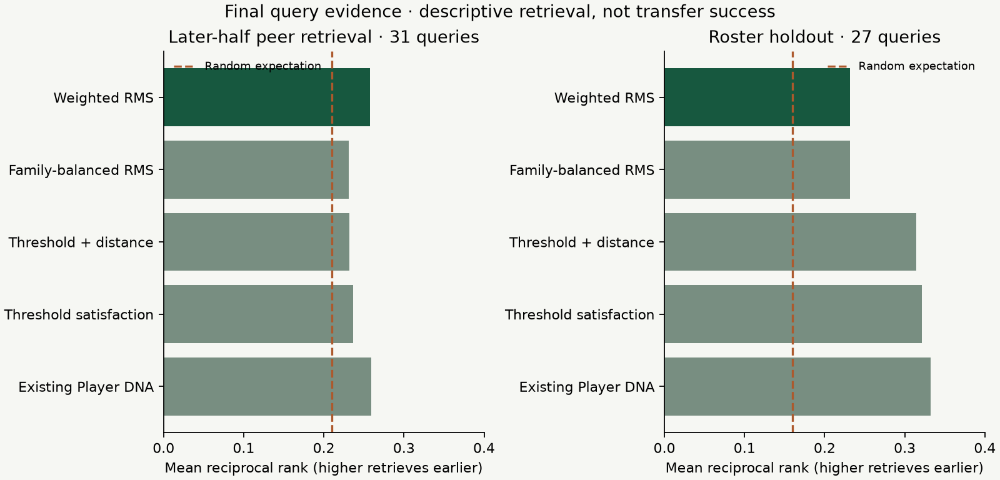
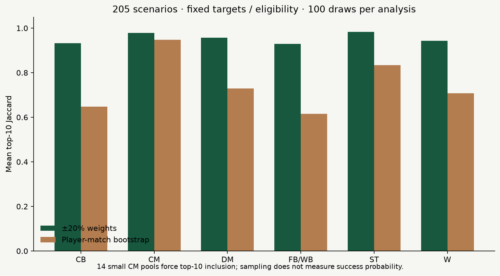

# Recruitment fit evaluation — Phase 4

`recruitment-fit-v1` · `requirements-v1` · `club-context-v1` · WSL 2023/24.

Weighted directional RMS provides transparent ordering under an analyst's requirements. The small retrospective experiments show some retrieval signal above chance, with limited separation from existing Player DNA and mixed context gains. They do not establish transfer success or expert scouting validity.

## Chronology and estimands

Evidence/schema commit `b2a6d57` preceded the registered [experiment](phase-4-experiment-plan.md), commit `2aa494e`. Scoring implementation `9a96a5a` preceded development evaluation. The [method decision](adr/007-recruitment-fit-method.md), commit `190bdc0`, preceded final outcomes at `c9982e5`. The registration and development hashes remain unchanged. The frozen decision's `final_queries_opened: false` records its state **at selection**, not the current completion state.

Eight clubs supplied development queries; four final query clubs (West Ham, Manchester City, Leicester and Brighton) were withheld from selection. Candidate pools overlap. The season and Phase 2 representation had already been examined. This is a query holdout, not a wholly unseen season or population.

Known-peer retrieval uses the median match-date split, **27 January 2024**, at least 450 reliable minutes in each half and stable roles. Earlier-half transforms are fitted before scoring; the label is the later-half nearest *other* peer under the existing DNA representation fitted on earlier observations. There are 89 paired profiles; two multi-club queries are omitted, leaving 56 development and 31 final queries. This is representation consistency, not a football-success label.

Roster holdout removes each eligible single-club query from its club-role target, reference percentile/scaling fit and team counts. At least two eligible role-mates remain. Those role-mates are excluded as candidate alternatives; the held-out player stays in the candidate pool. Three exact requirements use remaining role medians (progressive passes, progressive carries, pressures). This measures descriptive roster alignment. It can reward conformity and cannot distinguish complementarity from redundancy.

All methods, roles and sparse cases remain in the results. Recall@k means whether the designated profile is within k places; MRR averages reciprocal rank. Rank percentile is 100 × (N−rank)/(N−1), where higher places the designated profile earlier. Chance uses each query's actual N: min(k,N)/N and harmonic(N)/N, not an arbitrary universal baseline.

## Scoring and selection

For a candidate percentile x and target t, mismatch is |x−t| for exact, max(t−x,0) for minimum, max(x−t,0) for maximum, and absent for neutral. Distance is sqrt(sum(w × mismatch²)/sum(w)); lower is closer. Feature importance × family importance sets w; each explicit feature defaults to 1. Family balance is a registered comparator, not a hidden default. Hard constraints and reference exclusion run before scoring. Minutes and neighbour stability are evidence/filter dimensions, never fit terms. Stable IDs break distance ties at nine decimal places.

Weighted RMS passed development MRR-above-chance and mean weight-Jaccard ≥.65 gates. Family balance also passed and had greater DNA-neighbour agreement. The registered preference for equal explicit feature weights selected RMS; tiny metric differences did not establish a superior model. Threshold satisfaction (ten-point exact tolerance) and hybrid ordering are retained as research baselines but their discontinuities fail the continuous-severity requirement. No parameters were tuned on final queries.

## Retrieval and context ablations

Context ablations are 75% requirement squared distance +25% full role median, or 50% requirements +25% role +25% team. Team context uses matching count features with the held-out player's target-team counts removed; actual team minutes remain. In temporal experiments all contextual data is from the earlier half. Comparing team percentiles with player-role percentiles remains an ecological assumption, not a validated translation rule. The product instead requires explicit adoption of a contextual characteristic.

### Development: later-half peer retrieval

| Method | N | R@1 | R@5 | R@10 | MRR | Mean rank percentile | Candidates min/median/max |
|---|---:|---:|---:|---:|---:|---:|---|
| Existing Player DNA | 56 | 0.196 | 0.732 | 0.875 | 0.402 | 72.4 | 4/13/25 |
| Family-balanced RMS | 56 | 0.196 | 0.643 | 0.857 | 0.388 | 71.6 | 4/13/25 |
| Threshold + distance | 56 | 0.196 | 0.464 | 0.786 | 0.351 | 65.1 | 4/13/25 |
| Threshold satisfaction | 56 | 0.179 | 0.518 | 0.732 | 0.336 | 61.0 | 4/13/25 |
| Weighted RMS (selected) | 56 | 0.196 | 0.679 | 0.839 | 0.391 | 72.6 | 4/13/25 |
| Random expectation | 56 | 0.081 | 0.384 | 0.678 | 0.241 | 50 | same pools |

### Development: roster holdout

| Method | N | R@1 | R@5 | R@10 | MRR | Mean rank percentile | Candidates min/median/max |
|---|---:|---:|---:|---:|---:|---:|---|
| Existing Player DNA | 44 | 0.136 | 0.364 | 0.545 | 0.264 | 59.3 | 10/27/34 |
| Family-balanced RMS | 44 | 0.068 | 0.341 | 0.545 | 0.208 | 61.2 | 10/27/34 |
| Threshold + distance | 44 | 0.091 | 0.386 | 0.727 | 0.254 | 65.7 | 10/27/34 |
| Requirements + role + team | 44 | 0.114 | 0.318 | 0.636 | 0.247 | 64.1 | 10/27/34 |
| Requirements + role median | 44 | 0.091 | 0.364 | 0.591 | 0.229 | 63.6 | 10/27/34 |
| Threshold satisfaction | 44 | 0.068 | 0.341 | 0.727 | 0.231 | 62.8 | 10/27/34 |
| Weighted RMS (selected) | 44 | 0.068 | 0.341 | 0.545 | 0.208 | 61.2 | 10/27/34 |
| Random expectation | 44 | 0.045 | 0.225 | 0.450 | 0.163 | 50 | same pools |

### Development: temporal context, common supported queries only

| Method | N | R@1 | R@5 | R@10 | MRR | Mean rank percentile | Candidates min/median/max |
|---|---:|---:|---:|---:|---:|---:|---|
| Requirements + role + team | 12 | 0.417 | 0.583 | 0.667 | 0.513 | 75.7 | 4/19/25 |
| Requirements + role median | 12 | 0.333 | 0.583 | 0.667 | 0.464 | 70.1 | 4/19/25 |
| Requirements only | 12 | 0.250 | 0.583 | 0.667 | 0.412 | 69.1 | 4/19/25 |
| Random expectation | 12 | 0.102 | 0.446 | 0.642 | 0.268 | 50 | same pools |

### Final: later-half peer retrieval

| Method | N | R@1 | R@5 | R@10 | MRR | Mean rank percentile | Candidates min/median/max |
|---|---:|---:|---:|---:|---:|---:|---|
| Existing Player DNA | 31 | 0.097 | 0.419 | 0.806 | 0.259 | 60.2 | 10/18/25 |
| Family-balanced RMS | 31 | 0.065 | 0.419 | 0.774 | 0.231 | 56.8 | 10/18/25 |
| Threshold + distance | 31 | 0.065 | 0.355 | 0.806 | 0.232 | 58.8 | 10/18/25 |
| Threshold satisfaction | 31 | 0.097 | 0.258 | 0.806 | 0.237 | 58.3 | 10/18/25 |
| Weighted RMS (selected) | 31 | 0.065 | 0.452 | 0.806 | 0.258 | 60.7 | 10/18/25 |
| Random expectation | 31 | 0.063 | 0.316 | 0.632 | 0.210 | 50 | same pools |

### Final: roster holdout

| Method | N | R@1 | R@5 | R@10 | MRR | Mean rank percentile | Candidates min/median/max |
|---|---:|---:|---:|---:|---:|---:|---|
| Existing Player DNA | 27 | 0.222 | 0.370 | 0.667 | 0.332 | 68.7 | 10/27/34 |
| Family-balanced RMS | 27 | 0.074 | 0.333 | 0.667 | 0.232 | 59.6 | 10/27/34 |
| Threshold + distance | 27 | 0.148 | 0.444 | 0.630 | 0.314 | 65.8 | 10/27/34 |
| Requirements + role + team | 27 | 0.148 | 0.333 | 0.667 | 0.277 | 64.2 | 10/27/34 |
| Requirements + role median | 27 | 0.148 | 0.407 | 0.667 | 0.271 | 61.7 | 10/27/34 |
| Threshold satisfaction | 27 | 0.185 | 0.444 | 0.667 | 0.321 | 72.3 | 10/27/34 |
| Weighted RMS (selected) | 27 | 0.074 | 0.333 | 0.667 | 0.232 | 59.6 | 10/27/34 |
| Random expectation | 27 | 0.044 | 0.220 | 0.440 | 0.160 | 50 | same pools |

### Final: temporal context, common supported queries only

| Method | N | R@1 | R@5 | R@10 | MRR | Mean rank percentile | Candidates min/median/max |
|---|---:|---:|---:|---:|---:|---:|---|
| Requirements + role + team | 12 | 0.000 | 0.417 | 0.750 | 0.210 | 61.5 | 13/19/25 |
| Requirements + role median | 12 | 0.000 | 0.417 | 0.750 | 0.218 | 61.5 | 13/19/25 |
| Requirements only | 12 | 0.000 | 0.417 | 0.667 | 0.223 | 54.2 | 13/19/25 |
| Random expectation | 12 | 0.058 | 0.292 | 0.585 | 0.199 | 50 | same pools |

Final weighted peer Recall@5 is 45.2% versus 31.6% random; MRR .258 is essentially the same as existing DNA .259. With only 31 queries, shared candidate pools and representation-derived labels, these differences are not proof of scouting value. Threshold satisfaction's final Recall@5 (.258) is below chance (.316), despite slightly higher MRR than chance.

Context has **mixed**, not uniformly negative, results. Final roster MRR improves from .232 to .271 with role median and .277 with team context, while existing DNA remains higher at .332. Final temporal context MRR falls .223 → .218 → .210, but Recall@10 increases .667 → .750. Development temporal context MRR had improved .412 → .464 → .513. These tiny, selected subgroups do not justify a general context claim.

### Final role-level results: selected method

| Task | Role | N | R@5 | R@10 | MRR |
|---|---|---:|---:|---:|---:|
| temporal | CB | 10 | 0.400 | 0.500 | 0.245 |
| temporal | DM | 5 | 0.200 | 1.000 | 0.152 |
| temporal | FB/WB | 7 | 0.571 | 0.857 | 0.237 |
| temporal | ST | 4 | 0.500 | 1.000 | 0.403 |
| temporal | W | 5 | 0.600 | 1.000 | 0.301 |
| roster | CB | 12 | 0.083 | 0.500 | 0.115 |
| roster | CM | 3 | 0.000 | 1.000 | 0.134 |
| roster | DM | 3 | 0.667 | 1.000 | 0.448 |
| roster | FB/WB | 3 | 0.000 | 0.000 | 0.044 |
| roster | W | 6 | 1.000 | 1.000 | 0.500 |

Final temporal CM has no eligible query; final roster ST has none. Missing rows are not zeros. Final CB roster Recall@5 is only .083 (12 queries); final FB/WB roster Recall@10 is zero (three queries). These failures remain visible. All methods' role metrics and every query's candidate size/rank are in the complete [development](../artifacts/phase4/development_evaluation.json) and [final](../artifacts/phase4/final_evaluation.json) artifacts.

## Replacement reconstruction and weights

Exact full-profile targets remove the reference player. Overlap with existing DNA neighbours measures representation agreement, not correctness. Final reconstruction has 46 single-club queries; development has 87.

| Stage | Method | N | Mean top-10 weight Jaccard | Mean DNA-neighbour Jaccard |
|---|---|---:|---:|---:|
| development | Family-balanced RMS | 87 | 0.960 | 0.766 |
| development | Threshold + distance | 87 | 0.990 | 0.493 |
| development | Threshold satisfaction | 87 | 0.858 | 0.446 |
| development | Weighted RMS (selected) | 87 | 0.945 | 0.721 |
| final | Family-balanced RMS | 46 | 0.968 | 0.727 |
| final | Threshold + distance | 46 | 0.991 | 0.529 |
| final | Threshold satisfaction | 46 | 0.836 | 0.494 |
| final | Weighted RMS (selected) | 46 | 0.953 | 0.719 |

## Separate robustness analyses

205 registered scenarios: 72 club-role three-feature custom profiles and 133 single-club full-profile replacements. Custom thresholds (75 progressive passes, 70 progressive carries, 75 pressures) are research assumptions and are not silently preselected in the UI.

Weight sensitivity uses 100 independent ±20% multipliers on active weights, shared seed 20260930 and a deterministic LCG. Profile sensitivity uses 100 whole-player-match bootstraps, preserving feature/minute dependence within a sampled row and recomputing rates. Percentiles use the fixed original role ECDF; published samples are quantized to 0.1 percentile point. Eligibility, targets, hard constraints and roles stay fixed. The two analyses are intentionally not averaged into a confidence score. Per-candidate inclusion and 10th–90th rank intervals are reported separately.

| Group | Scenarios | Pools ≤10 | Weight Jaccard mean | Profile Jaccard mean | Frontier median |
|---|---:|---:|---:|---:|---:|
| All | 205 | 14 | 0.950 | 0.723 | 19 |
| Pools >10 | 191 | 0 | 0.946 | 0.703 | 19 |
| custom | 72 | 4 | 0.953 | 0.723 | 2.5 |
| replacement | 133 | 10 | 0.948 | 0.724 | 22 |
| CB | 46 | 0 | 0.932 | 0.648 | 32 |
| CM | 23 | 14 | 0.978 | 0.948 | 7 |
| DM | 34 | 0 | 0.957 | 0.730 | 19 |
| FB/WB | 40 | 0 | 0.930 | 0.615 | 26 |
| ST | 27 | 0 | 0.983 | 0.834 | 12 |
| W | 35 | 0 | 0.943 | 0.708 | 21 |

| Analysis | Minimum | P10 | Median | P90 | Maximum |
|---|---:|---:|---:|---:|---:|
| weight | 0.806 | 0.889 | 0.953 | 1.000 | 1.000 |
| profile | 0.488 | 0.595 | 0.691 | 0.885 | 1.000 |

Fourteen CM scenarios have at most ten candidates, forcing top-10 inclusion to 100%. Larger-pool results (.946 weights, .703 profiles) better expose sensitivity. Profile sampling affects the ordering substantially more than modest weight changes, especially CB and FB/WB. Hard constraints are held fixed during profile resampling: this is ranking sensitivity conditional on observed eligibility, not uncertainty about constraint compliance. Shared team/match dependence, target uncertainty, injuries, tactical change and external validity are absent. Bootstrap inclusion is not a success probability or calibrated confidence level.

### Least stable custom scenarios under profile sampling

| Club | Role | Eligible | Weight Jaccard | Profile Jaccard | Frontier size |
|---|---|---:|---:|---:|---:|
| West Ham United LFC | FB/WB | 27 | 0.951 | 0.548 | 1 |
| Leicester City WFC | FB/WB | 26 | 0.932 | 0.572 | 1 |
| Chelsea FCW | FB/WB | 26 | 0.932 | 0.572 | 1 |
| Manchester City WFC | FB/WB | 27 | 0.932 | 0.579 | 1 |
| Tottenham Hotspur Women | FB/WB | 26 | 0.960 | 0.593 | 5 |

## Pareto trade-offs

A candidate is dominated only when another eligible candidate is no worse on every active mismatch and strictly better on at least one. Ties remain on the frontier; evidence is not a criterion. Weight changes do not alter this unweighted frontier. The UI shows flags/counts beside a bounded top ten, with the actual per-feature differences available in comparison.

For three-criterion custom scenarios, the median frontier has **2.5 players**, range **1–7**. For eighteen-feature replacements the median is **22**, range **8–34**: high dimensionality makes non-dominance weak evidence of usefulness. The product warns when most candidates share the frontier. All 72 custom cases include per-candidate frontier membership over 100 profile samples in [robustness.json](../artifacts/phase4/robustness.json); replacement frontier bootstrap is deliberately withheld because near-universal membership is uninformative. No list is called an optimal-player set.

## Evidence limits and reproducibility

The [historical audit](phase-4-fit-evidence.md) found only twelve minute-eligible recorded team changes at 900 minutes, nine ending 2019/20 and three 2020/21. Real availability, recruitment opportunities and success labels are absent; destination observations were already studied. Transfer-success evaluation is **NO-GO**. Do not call these tests transfer accuracy, current recruitment advice, or 2024/25 predictions.

Observed 2023/24 rankings never use the historical Phase 3 predictions. The separate 2019/20 → 2020/21 study retains its simple defaults, undercoverage warnings and cross-league NO-GO. Player DNA features and representations remain unchanged. Five eligible multi-club players are labelled whole-season composites; club roster references instead use ≥900-minute club stints. Age, salary, contracts, nationality and market value are absent.

`make phase4-build` rebuilds club/index/bootstrap aggregates from the pinned canonical cohort and republishes strict allowlists using the frozen selection/results. A clean first run downloads the checksum-locked 132-match cohort; cached reruns need no network. `make recruitment-evaluate` recomputes all query and robustness results and compares at 1e-10 tolerance, ignoring only the current code-commit metadata; it never overwrites frozen evidence or reselects a method. `uv run python scripts/recruitment_reports.py` renders this report and figures from committed results.

Public aggregate numbers are rounded to eight decimals; bootstrap percentiles are quantized to tenths. Ten Python reference scenarios test browser ordering, contribution values, exclusions, Pareto membership, URL reconstruction and both robustness summaries at 1e-7 tolerance. During product QA the reference-scenario helper's mode metadata was corrected (replacement IDs require replacement mode); all scientific results reproduced unchanged. Additional season/duplicate guards do not alter valid outputs. [Model card](model-card-phase4.md) · [QA](phase-4-qa.md) · [Phase 5 hand-off](phase-5-handoff.md).
